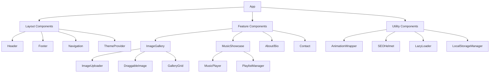

# Final Implementation Plan for Custom Portfolio Website

## Project Architecture Overview



## Refined Tech Stack

- **Core Framework**: React 18 with Vite (for fast development & optimized builds)
- **Styling**: 
  - Tailwind CSS with custom theme configuration
  - CSS Modules for component-specific styling
- **Animation**: Framer Motion for page transitions and micro-interactions
- **State Management**: 
  - React Context API for theme/global state
  - Local storage for persisting user preferences and content
- **Image Management**: 
  - React-DnD for drag & drop functionality
  - Browser's File API for image uploads
  - Simple file-based storage for easy updates
- **Music Integration**: 
  - React wrapper components for SoundCloud, Spotify, and YouTube embeds
  - Simple JSON configuration for easy updates
- **Performance**: 
  - Code splitting with React.lazy and Suspense
  - Image lazy loading and optimization
- **Responsive Design**:
  - Mobile-first approach with Tailwind breakpoints
  - Flexible layouts that adapt to different screen sizes
- **Deployment**: GitHub Actions for CI/CD to GitHub Pages

## Content Management Strategy

The content management approach is designed for frequent updates of images and music content:

1. **Image Management**:
   - Simple JSON-based configuration for image metadata
   - Drag-and-drop interface for rearranging images
   - Easy upload mechanism with browser's File API
   - Images stored in the repository for simplicity

2. **Music Content**:
   - JSON configuration file for music links and metadata
   - Simple form interface for adding new music links
   - Support for SoundCloud, Spotify, and YouTube embeds

3. **Update Process**:
   - Web-based editor for making simple content updates
   - Changes saved to localStorage and exportable as JSON
   - Option to commit changes directly to GitHub (for technical users)
   - Alternative simple update guide for non-technical updates

## Detailed Implementation Plan

### Phase 1: Project Setup & Core Structure (1-2 days)

1. **Environment Configuration**
   - Initialize Vite project with React template
   - Configure Tailwind CSS with custom theme
   - Set up ESLint and Prettier for code quality
   - Configure GitHub repository with proper .gitignore

2. **Project Structure**
   ```
   src/
   ├── assets/         # Static assets (images, fonts)
   ├── components/     # Reusable UI components
   │   ├── layout/     # Layout components
   │   ├── gallery/    # Image gallery components
   │   ├── music/      # Music showcase components
   │   └── ui/         # Generic UI components
   ├── context/        # React Context providers
   ├── hooks/          # Custom React hooks
   ├── pages/          # Page components
   ├── utils/          # Utility functions
   ├── data/           # JSON data files for content
   ├── App.jsx         # Main App component
   └── main.jsx        # Entry point
   ```

3. **Core Layout Implementation**
   - Create responsive layout with Header, Footer, and main content area
   - Implement theme switching (dark/light mode) with Context API
   - Set up basic routing structure
   - Implement mobile-first responsive design

### Phase 2: Image Gallery Implementation (2-3 days)

1. **Image Storage Strategy**
   - Create `data/images.json` for image metadata
   - Implement utility functions for image processing
   - Set up folder structure for organized image storage

2. **Gallery Components**
   - Create `ImageUploader` component with drag & drop zone
   - Implement `DraggableImage` component with React-DnD
   - Build `GalleryGrid` with responsive masonry layout
   - Add image metadata handling (captions, tags)

3. **Gallery State Management**
   - Create custom hook for gallery state management
   - Implement persistence with localStorage
   - Add image reordering functionality
   - Create export functionality for saving changes

### Phase 3: Music Showcase Implementation (1-2 days)

1. **Music Data Structure**
   - Create `data/music.json` for music links and metadata
   - Design flexible schema for different music platforms

2. **Music Embed Components**
   - Create wrapper components for SoundCloud, Spotify, and YouTube
   - Implement responsive design for different screen sizes
   - Add lazy loading for embeds to improve performance

3. **Music Management Interface**
   - Create simple form for adding new music links
   - Implement persistence with localStorage
   - Add export functionality for saving changes

### Phase 4: Animation & UI Polish (1-2 days)

1. **Animation Implementation**
   - Create `AnimationWrapper` component using Framer Motion
   - Implement page transitions and micro-interactions
   - Add scroll-triggered animations
   - Ensure animations work well on mobile devices

2. **UI Refinement**
   - Implement flexible design system with Tailwind
   - Create placeholder styling that can be easily customized later
   - Ensure good mobile and desktop compatibility
   - Implement responsive navigation

### Phase 5: Content Management Interface (1-2 days)

1. **Admin Interface**
   - Create simple password-protected admin area
   - Implement content editing interface
   - Add export/import functionality for content

2. **Update Workflow**
   - Create documentation for content update process
   - Implement simple GitHub integration (optional)
   - Add validation for content updates

### Phase 6: Performance & Deployment (1 day)

1. **Performance Optimization**
   - Implement code splitting with React.lazy
   - Add image lazy loading and optimization
   - Test performance on mobile devices

2. **Deployment Setup**
   - Configure GitHub Pages deployment
   - Set up GitHub Actions workflow
   - Create CNAME file for custom domain (if needed)

3. **Testing & Validation**
   - Cross-browser testing
   - Mobile responsiveness validation
   - Basic performance testing

## Development Timeline

- **Total Estimated Time**: 7-12 days
- **Phase Breakdown**:
  - Setup & Core Structure: 1-2 days
  - Image Gallery: 2-3 days
  - Music Showcase: 1-2 days
  - Animation & UI: 1-2 days
  - Content Management: 1-2 days
  - Performance & Deployment: 1 day

## Implementation Details

### Component Specifications

#### Layout Components

1. **Header Component**
   - Responsive navigation menu (hamburger on mobile)
   - Theme toggle button
   - Logo/name display
   - Implementation: React component with Tailwind CSS

2. **Footer Component**
   - Social media links
   - Copyright information
   - Contact links
   - Implementation: React component with Tailwind CSS

3. **ThemeProvider**
   - Dark/light mode context
   - Theme persistence with localStorage
   - Implementation: React Context API

#### Feature Components

1. **ImageGallery**
   - **Key Features**:
     - Masonry grid layout
     - Drag and drop reordering
     - Image upload functionality
     - Image metadata editing
   - **Implementation**:
     - React-DnD for drag and drop
     - CSS Grid for layout
     - File API for uploads
     - LocalStorage for persistence

2. **MusicShowcase**
   - **Key Features**:
     - Embedded players for different platforms
     - Playlist management
     - Responsive layout
   - **Implementation**:
     - Platform-specific embed components
     - JSON configuration for music links
     - Responsive container with Tailwind

3. **About/Bio Section**
   - **Key Features**:
     - Editable text content
     - Optional image
     - Animated elements
   - **Implementation**:
     - Editable content with simple admin interface
     - Framer Motion for animations

4. **Contact Section**
   - **Key Features**:
     - Contact form (optional)
     - Social media links
     - Direct email link
   - **Implementation**:
     - Simple form with validation
     - Icon components for social links

#### Utility Components

1. **AnimationWrapper**
   - Reusable animation container
   - Configurable animation types
   - Implementation: Framer Motion

2. **LazyLoader**
   - Lazy loading for images and components
   - Loading placeholders
   - Implementation: React.lazy and Intersection Observer

3. **LocalStorageManager**
   - Utilities for saving/loading from localStorage
   - Data versioning
   - Implementation: Custom React hooks

### Data Management

1. **Content Schema**
   - **Images**:
     ```json
     {
       "images": [
         {
           "id": "unique-id",
           "src": "path/to/image.jpg",
           "alt": "Image description",
           "caption": "Optional caption",
           "tags": ["tag1", "tag2"],
           "order": 1
         }
       ]
     }
     ```

   - **Music**:
     ```json
     {
       "music": [
         {
           "id": "unique-id",
           "title": "Track title",
           "artist": "Artist name",
           "platform": "spotify|soundcloud|youtube",
           "embedUrl": "https://embed.url",
           "thumbnailUrl": "path/to/thumbnail.jpg",
           "order": 1
         }
       ]
     }
     ```

2. **State Management Strategy**
   - Use React Context for global state
   - Use custom hooks for feature-specific state
   - Persist state in localStorage with versioning
   - Provide export/import functionality for backup

### Admin Interface

1. **Authentication**
   - Simple password protection (client-side)
   - Session persistence with localStorage

2. **Content Editor**
   - Form-based editors for different content types
   - Live preview of changes
   - Save/cancel functionality

3. **Export/Import**
   - JSON export of all content
   - Import validation
   - Backup reminder functionality

## Future Enhancement Possibilities

1. **Design Refinement**
   - Once you have design preferences, we can implement a more customized look
   - Add animation and interaction refinements

2. **Advanced Content Management**
   - If content updates become more frequent, consider integrating a headless CMS
   - Options include Contentful, Sanity, or Strapi

3. **SEO Enhancements**
   - Add more advanced SEO features when requirements are defined
   - Implement structured data for rich snippets

4. **Analytics Integration**
   - Add simple analytics to track visitor engagement
   - Implement event tracking for specific interactions

## Technical Considerations

1. **Browser Compatibility**
   - Target modern browsers (last 2 versions)
   - Graceful degradation for older browsers

2. **Performance Targets**
   - First Contentful Paint < 1.5s
   - Time to Interactive < 3s
   - Optimize for mobile networks

3. **Accessibility**
   - WCAG 2.1 AA compliance
   - Keyboard navigation support
   - Screen reader friendly

4. **Security Considerations**
   - Content validation for user inputs
   - Safe storage of content
   - XSS protection

## Implementation Approach

The implementation will follow an incremental approach:

1. **Core Structure First**: Build the foundational components and layout
2. **Feature by Feature**: Implement each major feature completely before moving to the next
3. **Polish Last**: Add animations and refinements after core functionality is complete
4. **Test Throughout**: Regular testing on different devices and browsers

This approach ensures that at each stage of development, there is a functional product that can be reviewed and tested.
